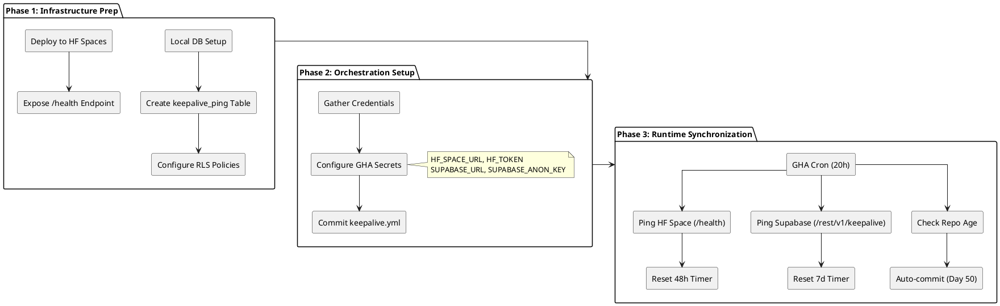
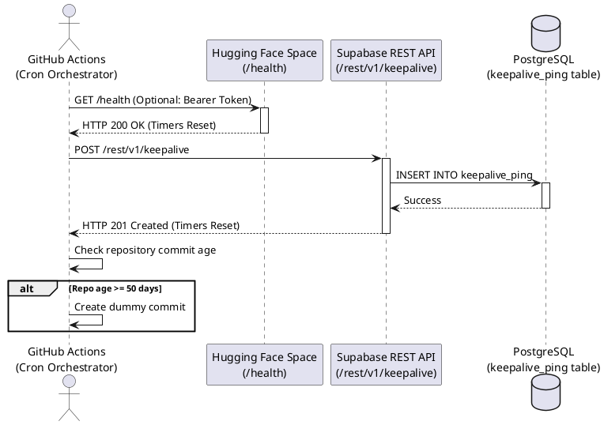

# Orchestration Workflow

## Deployment Sequencing & Workflow

The orchestration pipeline is divided into three distinct phases to ensure proper synchronization between the local environment, GitHub Actions, and the cloud services.

## Sequence of Events (Runtime)

## Explanation

1. **Infrastructure Prep:** The database must be prepared with the proper schema and RLS policies before the automation begins. The `/health` endpoint must return a 200 OK.
2. **Orchestration Setup:** Secrets map the orchestrator (GitHub Actions) to the targets.
3. **Runtime:** The dual-ping approach ensures both systems receive traffic, remaining synchronized and active.